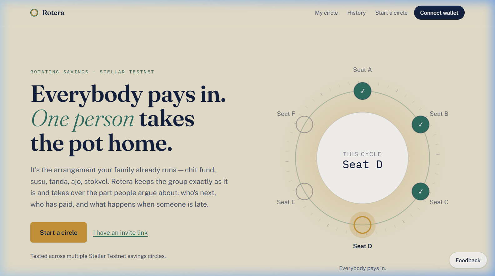
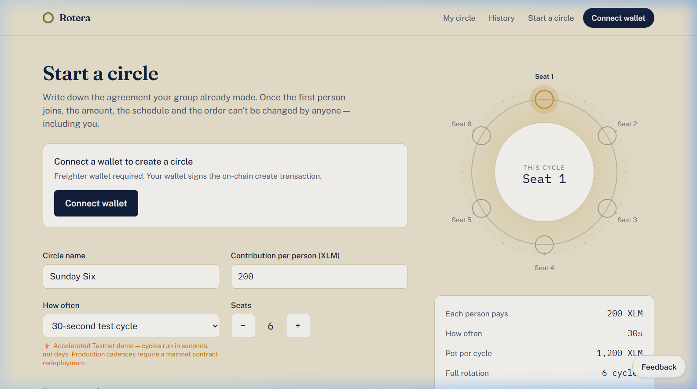
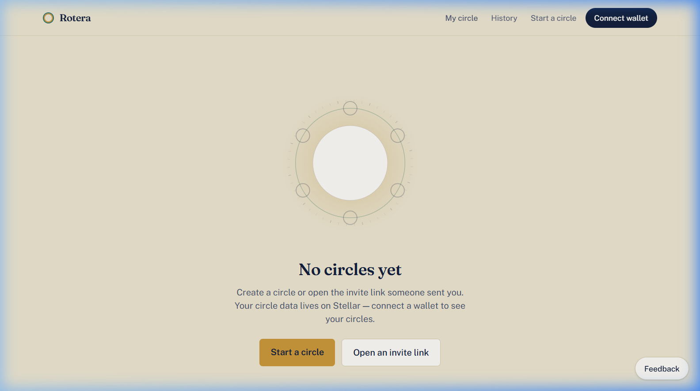
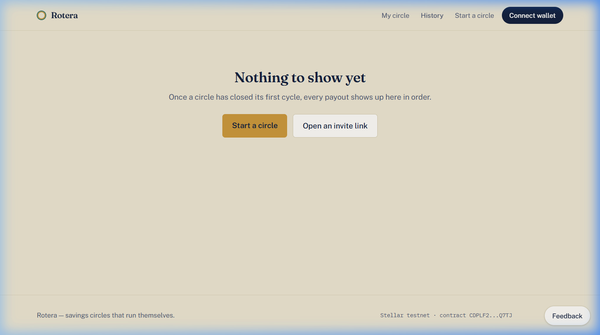
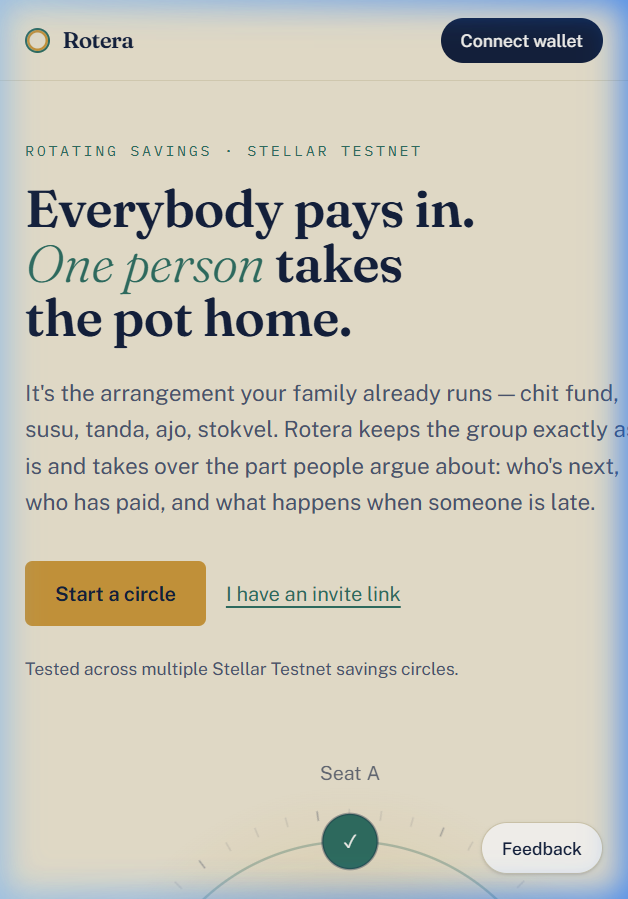
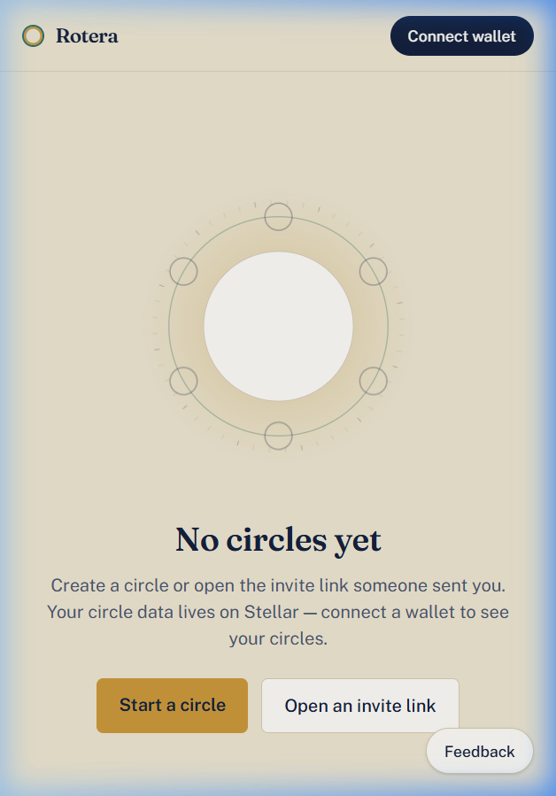
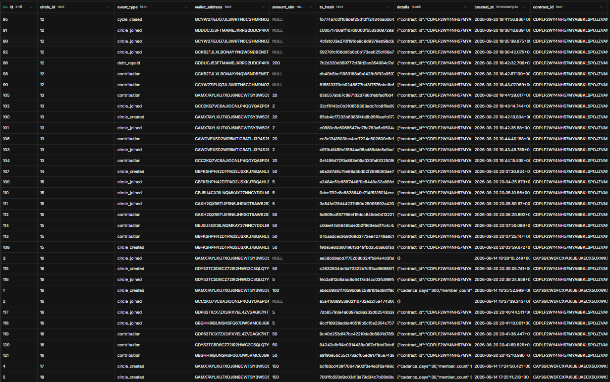
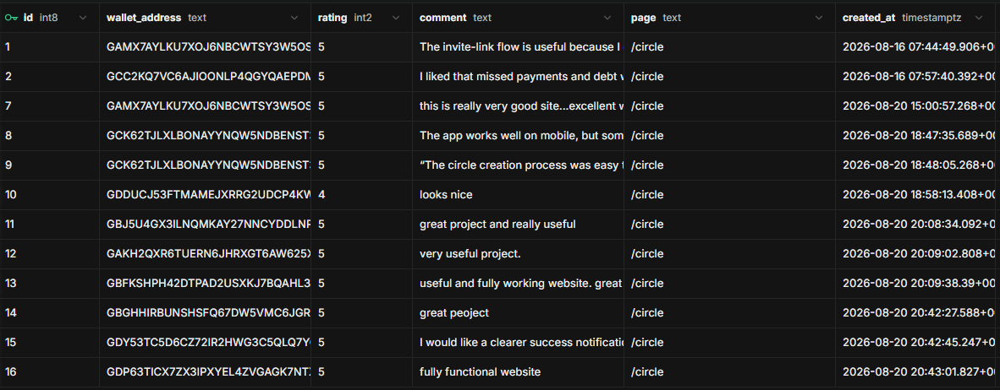
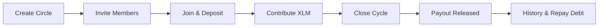

# ROTera

> **On-chain rotating savings and credit associations (ROSCAs) powered natively by Stellar Soroban.**

ROTera is an on-chain rotating savings circle (ROSCA) platform built on Stellar Soroban. Members contribute a fixed XLM amount each cycle, and the smart contract strictly enforces membership, turn-based contributions, payout rotation, 10% collateral deposits, missed-payment debt recording, debt repayment, and deposit withdrawals without relying on a trusted human coordinator.

---

## Quick Links

- 🌐 **Live Production Application**: [https://rotera-seven.vercel.app/](https://rotera-seven.vercel.app/)
- 📜 **Verified Stellar Testnet Contract**: [`CDPLF2WY4NH57MYABBKLSPOJZVAMBFM5N2F5P7SPXS4KF2L6MRPMQ7TJ`](https://stellar.expert/explorer/testnet/contract/CDPLF2WY4NH57MYABBKLSPOJZVAMBFM5N2F5P7SPXS4KF2L6MRPMQ7TJ)
- 📂 **Full Green Belt Submission Dossier**: [`docs/GREEN_BELT_SUBMISSION.md`](./docs/GREEN_BELT_SUBMISSION.md)
- 💻 **Public GitHub Repository**: [https://github.com/subhadip890/Rotera.git](https://github.com/subhadip890/Rotera.git)

---

## Stellar Level 4 — Green Belt Submission Snapshot

| Metric / Requirement | Verified Status | Reference |
| :--- | :--- | :--- |
| **Production Deployment** | Live on Vercel (Nitro SSR) | [rotera-seven.vercel.app](https://rotera-seven.vercel.app/) |
| **Target Blockchain Network** | Stellar Testnet | RPC: `soroban-testnet.stellar.org` |
| **Verified Smart Contract** | `CDPLF2WY4NH57MYABBKLSPOJZVAMBFM5N2F5P7SPXS4KF2L6MRPMQ7TJ` | [Stellar Expert Explorer](https://stellar.expert/explorer/testnet/contract/CDPLF2WY4NH57MYABBKLSPOJZVAMBFM5N2F5P7SPXS4KF2L6MRPMQ7TJ) |
| **Contract Unit Test Suite** | 47 passed; 0 failed | Cargo test suite (`contracts/rosca`) |
| **Commit History** | 40 meaningful commits | `main` branch |
| **Unique Interacting Wallets** | 12 unique wallets | On-chain contract event logs |
| **Verified Testnet Events** | 50 confirmed transactions | On-chain transaction records |
| **Matched Feedback Testers** | 10 unique testers | 100% matched to on-chain activity |
| **User Feedback Submissions** | 12 real submissions | Average rating: **4.92 / 5.0** |
| **Mobile Responsiveness** | Verified (375px viewport) | Embedded responsive UI proof |
| **Error Monitoring & Telemetry** | Sentry + PostHog integrated | Client telemetry guards |

---

## Verified Level 4 Evidence

| Requirement | Evidence Summary | Verification Source |
| :--- | :--- | :--- |
| **Production MVP** | Fully functional decentralized ROSCA dApp running on Stellar Testnet and live Vercel SSR | [Live App](https://rotera-seven.vercel.app/) |
| **Stellar Testnet Contract** | Deployed contract managing circle state, escrowed deposits, and automated turn rotation | [`CDPLF2...Q7TJ`](https://stellar.expert/explorer/testnet/contract/CDPLF2WY4NH57MYABBKLSPOJZVAMBFM5N2F5P7SPXS4KF2L6MRPMQ7TJ) |
| **Stable Smart Contract** | 47 automated unit tests covering creation, joining, deadlines, debt, and payouts | `npm run test:contract` |
| **Mobile Responsive UI** | Responsive roundtable SVG, mobile-first design, and touch controls on 375px viewports | [Mobile Screenshots](#mobile-experience) |
| **10+ Real User Validation** | 12 unique transaction wallets and 10 matched feedback testers with confirmed activity | [User Validation](#real-user-validation) |
| **Wallet Interaction Proof** | 50 real Stellar Testnet transactions logged on-chain across Circles #10–#16 | [Wallet Proof](#wallet-interaction-evidence) |
| **Feedback Collection** | In-app feedback drawer with 12 real submissions (average rating 4.92 / 5.0) | [Feedback Proof](#user-feedback-evidence) |
| **Public Repository** | Clean, structured, well-documented repository on GitHub | [GitHub Repo](https://github.com/subhadip890/Rotera.git) |
| **15+ Meaningful Commits** | 40 clean engineering commits across contract, frontend, and telemetry | `git log` |
| **Product UI Evidence** | High-fidelity screenshots of landing, creation, dashboard, and history views | [Product Preview](#product-preview) |
| **Monitoring & Analytics** | Integrated Sentry error monitoring and PostHog product telemetry | `src/lib/sentry.ts`, `src/lib/posthog.ts` |

---

## Product Preview

<p align="center">
  
  
</p>
<p align="center">
  
  
</p>

### Mobile Experience

<p align="center">
  
  &nbsp;&nbsp;&nbsp;&nbsp;
  
</p>

---

## Real User Validation

Rotera was validated through real on-chain testing and user feedback on Stellar Testnet:
- **12 Unique Interacting Wallets**: Generated 50 on-chain lifecycle events across Circles #10, #11, #12, #13, #14, #15, and #16.
- **10 Matched Feedback Testers**: 10 feedback submitters matched directly to wallets with verified Testnet activity.
- **12 Real Feedback Submissions**: 11 ratings of 5★ and 1 rating of 4★ (Average: **4.92 / 5.0**).

### Wallet Interaction Evidence

<p align="center">
  
</p>
<p align="center"><em>Contract-scoped audit records showing Stellar Testnet lifecycle events, wallet addresses, transaction hashes, amounts, and timestamps.</em></p>

### Matched Tester Evidence

| Tester | Wallet Address | Verified Activity | Representative Transaction Hash | Rating |
| :---: | :--- | :--- | :--- | :---: |
| **T01** | `GDP63T...CJGT` | Contribution, Circle Joined | [`9c40d253...adecf4`](https://stellar.expert/explorer/testnet/tx/9c40d253df47bc42219de9b5891d7850d00bfdd91ae6c112981eba0af1adecf4) | ★★★★★ |
| **T02** | `GDY53T...DS4W` | Contribution, Circle Joined, Circle Created | [`94242a1b...c7107e`](https://stellar.expert/explorer/testnet/tx/94242a1bff4c0014438a087ef1bbf3de63f9ae9608376ba3978a562014c7107e) | ★★★★★ |
| **T03** | `GBGHHI...UUIL` | Contribution, Circle Joined | [`a9f96e56...5207fb`](https://stellar.expert/explorer/testnet/tx/a9f96e56c55c173acf65ed917f85e7438d117a4cbd78e55e9976fbf40f5207fb) | ★★★★★ |
| **T04** | `GBFKSH...5C6N` | Contribution, Circle Joined, Circle Created | [`045aadce...949738`](https://stellar.expert/explorer/testnet/tx/045aadcec959069d3773ee42749a8c1058906346ca940eb5da3dd2656b949738) | ★★★★★ |
| **T05** | `GAKH2Q...AZ2F` | Contribution, Circle Joined | [`5d609cdf...93d3a6`](https://stellar.expert/explorer/testnet/tx/5d609cdf67766ef19dcc845de0413221f528c4568882085213ba9a1d7493d3a6) | ★★★★★ |
| **T06** | `GBJ5U4...BE5I` | Contribution, Circle Joined | [`c0dee14d...06fdc9`](https://stellar.expert/explorer/testnet/tx/c0dee14d5646bde2b2f963ebdf7b4c4a6867707aa311c64386ff026bc206fdc9) | ★★★★★ |
| **T07** | `GDDUCJ...HLII` | Contribution, Debt Repaid, Circle Joined | [`74bfe58f...54f4d2`](https://stellar.expert/explorer/testnet/tx/74bfe58fcba3f58a1339acc8e00996d651e297910a9bca854e38f81dae54f4d2) | ★★★★☆ |
| **T08** | `GCK62T...XPPJ` | Contribution, Circle Joined | [`db49b5be...36284f`](https://stellar.expert/explorer/testnet/tx/db49b5bef1889168a9a142fb8f92a9537a7d917382de2ca15fdf36aad636284f) | ★★★★★ |
| **T09** | `GAMX7A...5QCM` | Contribution, Circle Joined, Circle Created, Cycle Closed | [`63b557ab...c3379d`](https://stellar.expert/explorer/testnet/tx/63b557abb7c887102d786d1ebfadf6d470e3a5034aa7f1f929dd67be16c3379d) | ★★★★★ |
| **T10** | `GCC2KQ...DPL5` | Contribution, Circle Joined, Debt Repaid | [`0e1498d7...248392`](https://stellar.expert/explorer/testnet/tx/0e1498d72f0a893e05a030fa63225096f98ecfd65d94e4f56a79bbb7d8248392) | ★★★★★ |

### User Feedback Evidence

<p align="center">
  
</p>

#### What Testers Liked
- **Transparent Payout Sequence**: Clear visualization of whose turn is active and how the pot rotates.
- **Frictionless Onboarding**: Single-click shareable invite links (`/join/:circleId`) for easy circle participation.
- **Transparent Debt & Defaults**: Clear on-chain debt indicators when payments are missed, eliminating hidden shortfalls.

#### Improvements Implemented from Feedback
- **Mobile Screen Optimization**: Applied address truncation (`truncateAddr`) across all roundtable seat pills to prevent screen crowding.
- **Active Debt Repayment**: Enabled `repay_debt` directly during Active status so debtors can settle without waiting for circle completion.
- **Enhanced Confirmation Alerts**: Added clear payout toast notifications and explicit transaction hash explorer links.

---

## On-Chain Verification

Representative on-chain transactions confirmed on Stellar Testnet contract `CDPLF2WY4NH57MYABBKLSPOJZVAMBFM5N2F5P7SPXS4KF2L6MRPMQ7TJ`:

| Action | Circle | Transaction Hash | Explorer Link |
| :--- | :---: | :--- | :--- |
| **Create Circle** | #16 | `c2632634dd5d...` | [View on Stellar Expert](https://stellar.expert/explorer/testnet/tx/c2632634dd5d70322b7cff5cd86985f121c68f0dd823860a65d0d03a6176ba1c) |
| **Join Circle & Deposit** | #16 | `feb2a912d6ab...` | [View on Stellar Expert](https://stellar.expert/explorer/testnet/tx/feb2a912d6abd8d6417ad4cc03fc999fc8522602f0e728b2457a1a6ab65f30dd) |
| **Contribute XLM (50 XLM)** | #16 | `9c40d253df47...` | [View on Stellar Expert](https://stellar.expert/explorer/testnet/tx/9c40d253df47bc42219de9b5891d7850d00bfdd91ae6c112981eba0af1adecf4) |
| **Close Cycle & Release Payout** | #12 | `fb774a7c0f10...` | [View on Stellar Expert](https://stellar.expert/explorer/testnet/tx/fb774a7c0f108def25d10f124346adb644c01e7618b8a2755cfb1ea30d061d38) |
| **Repay Debt (200 XLM)** | #12 | `7b2d320d3697...` | [View on Stellar Expert](https://stellar.expert/explorer/testnet/tx/7b2d320d369777cf8fd2ee354994d7a16240c463be88d0fa807cba4e9af1e01a) |
| **Repay Debt (55 XLM)** | #10 | `04eb1c1586c0...` | [View on Stellar Expert](https://stellar.expert/explorer/testnet/tx/04eb1c1586c0189b47b895b014cba6d8cb0fc1ddf38858147ccc9906fc045691) |

*For the complete audit log of all 50 on-chain events, see [`docs/GREEN_BELT_SUBMISSION.md`](./docs/GREEN_BELT_SUBMISSION.md).*

---

## Architecture at a Glance

| Layer | Technology | Responsibility |
| :--- | :--- | :--- |
| **Frontend** | React 19 / TanStack Start / TypeScript / Tailwind | Responsive user interface, roundtable visualization, and state management |
| **Wallet** | Freighter API (`@stellar/freighter-api`) | Cryptographic user authentication and transaction signing |
| **Blockchain** | Stellar Testnet | Settlement network and ledger consensus |
| **Smart Contract** | Rust / Soroban SDK | **Authoritative source of truth** for all circle configuration, balances, debt, and payouts |
| **Audit & Feedback** | Supabase (PostgreSQL) | Supplemental event audit logs and user feedback collection |
| **Analytics** | PostHog | Privacy-preserving product event telemetry |
| **Monitoring** | Sentry | Production runtime error monitoring |
| **Deployment** | Vercel (Nitro Node SSR) | Production web hosting (`rotera-seven.vercel.app`) |

> **Authoritative State Note**: The Stellar Soroban smart contract is the sole authoritative source of truth for all circle state, member balances, and payouts. Supabase is used strictly for supplemental product history and user feedback.

---

## Problem & Solution

### Problem
Informal rotating savings groups pool billions of dollars worldwide (chit funds, susu, tanda, stokvel, ajo) to access lump-sum capital without banks. However, traditional ROSCAs suffer from severe failure modes:
- **Organizer Risk**: Human organizers can mismanage, miscalculate, or abscond with group funds.
- **Default Risk**: Members who receive early payouts often ghost later rounds, leaving others at a loss.
- **Coordination Disputes**: Manual tracking across messaging apps leads to disputes over who paid and who is late.

### Solution
- **Contract-Enforced Accounting & Permissionless Payout Execution**: Smart contracts tally all payments and enforce turn rotation on-chain. Once a deadline passes, `close_cycle` is permissionless — callable by any participant or keeper.
- **10% Collateral Holdback**: Every member locks a 10% entry deposit that remains locked in the contract until the entire rotation finishes and the member's outstanding debt is zero.
- **On-Chain Debt Tracking**: Missed contributions are recorded as explicit on-chain debt, reducing payout shortfalls transparently and enabling members to repay their balance anytime via `repay_debt()`.
- **Non-Custodial Self-Sovereignty**: Users authenticate exclusively via their Freighter wallet; Rotera never takes custody of user keys or funds.

---

## User Flow



1. **Create**: Organizer sets contribution amount, member count (3–12), payout ordering (join order or random), and cadence.
2. **Invite & Join**: Members open the shareable invite link (`/join/:circleId`), connect Freighter, and lock the 10% entry deposit.
3. **Contribute**: Once all seats are filled, the circle activates. Members deposit their share before each cycle deadline.
4. **Close Cycle (Keeper)**: When the deadline passes, `close_cycle` is called. The smart contract tallies payments, calculates shortfalls, transfers the pot to the recipient, and advances the cycle index.
5. **Missed Payment & Debt**: If a member misses a cycle, the contract records the shortfall as on-chain debt. The member can clear their balance anytime via `repay_debt()`.
6. **Completion & Deposit Return**: After a full rotation finishes and all debts are cleared, members withdraw their original 10% security deposit via `withdraw_deposit()`.

---

## Smart Contract Functions

The core ROSCA logic is implemented in Rust (`contracts/rosca/src/lib.rs`) on Stellar Soroban:

| Function | Access | Description |
|---|---|---|
| `create_circle` | Organizer | Creates a savings circle with contribution amount, member limit, and cadence. |
| `create_circle_with_duration` | Organizer | Creates a circle with an explicit `cycle_duration_seconds: u64` parameter. |
| `join_circle` | Member | Locks the 10% security deposit and adds the member to the circle. |
| `contribute` | Member | Deposits the member's cycle contribution before the deadline. |
| `close_cycle` | Permissionless | Evaluates contributions, records missed payments as debt, pays recipient, and advances cycle. |
| `repay_debt` | Member | Settles outstanding debt from previously missed contributions. |
| `withdraw_deposit` | Member | Releases the 10% security deposit once the circle is completed and all debts are zero. |
| `get_circle` | Public | Returns complete circle configuration, members, and cycle histories. |
| `get_member_circles` | Public | Returns a list of circle IDs associated with a specific wallet address. |
| `get_status` | Public | Returns lifecycle status (`Filling`, `Active`, `Completed`). |

---

## Stellar Testnet Contracts

### Current Verified Testnet Contract — Green Belt Submission
- **Network**: Stellar Testnet
- **Contract ID**: `CDPLF2WY4NH57MYABBKLSPOJZVAMBFM5N2F5P7SPXS4KF2L6MRPMQ7TJ`
- **RPC Endpoint**: `https://soroban-testnet.stellar.org`
- **Network Passphrase**: `Test SDF Network ; September 2015`
- **Native XLM Token Contract**: `CDLZFC3SYJYDZT7K67VZ75HPJVIEUVNIXF47ZG2FB2RMQQVU2HHGCYSC`
- **Stellar Expert Explorer**: [View Verified Contract on Stellar Expert](https://stellar.expert/explorer/testnet/contract/CDPLF2WY4NH57MYABBKLSPOJZVAMBFM5N2F5P7SPXS4KF2L6MRPMQ7TJ)
- **Features Verified**: Full ROSCA lifecycle, contract-enforced payouts, debt creation, partial & full `repay_debt`, zero-debt resolution, and collateral security deposits.

### Legacy Contract (Historical Development)
- **Contract ID**: `CAY3GCWDFCXPU6JEIJAECX5UXWKXSKO5WTAV3QUFXFXRV4USNQ2FKLO4`
- **Note**: Circles created on the legacy contract remain archived on-chain for historical evidence and are not migrated. All active application workflows query the current verified contract.

---

## Accelerated Testnet Mode & Production Timing

### Accelerated Testnet Cadences
When `VITE_ENABLE_TEST_CYCLES=true`:
- `10` = **10 seconds**
- `30` = **30 seconds**
- `60` = **60 seconds**
- `300` = **5 minutes** (300 seconds)

### Production Timing Architecture
For production/mainnet deployments, Rotera uses `create_circle_with_duration` with explicit seconds:
- **Weekly**: `604,800` seconds (7 days)
- **Bi-weekly**: `1,209,600` seconds (14 days)
- **Monthly**: `2,592,000` seconds (30 days)

---

## Supabase Audit Log & Schema Scoping

In addition to user feedback, Supabase stores supplemental audit event logs scoped by `(contract_id, circle_id)`:

```sql
create table if not exists circle_events (
  id bigint generated by default as identity primary key,
  contract_id text,
  circle_id text not null,
  event_type text not null,
  wallet_address text,
  amount_xlm numeric,
  tx_hash text,
  details jsonb default '{}'::jsonb,
  created_at timestamptz default now()
);

-- Index for performant contract_id + circle_id lookup:
create index if not exists idx_circle_events_contract_circle
on circle_events (contract_id, circle_id);
```

---

## Local Development & Testing

### Prerequisites
- Node.js (v18+) or Bun
- Rust toolchain (`rustup`) + `wasm32-unknown-unknown` target
- Freighter Browser Wallet Extension ([freighter.app](https://www.freighter.app/))

### Installation & Setup

```bash
# 1. Clone the repository
git clone https://github.com/subhadip890/Rotera.git
cd Rotera

# 2. Install dependencies
npm install

# 3. Configure environment variables
cp .env.example .env

# 4. Start local development server
npm run dev
```

### Verification Commands

```bash
# Full verification suite (typecheck + lint + build + contract tests)
npm run verify

# Individual checks
npm run typecheck       # TypeScript check (tsc --noEmit)
npm run lint            # ESLint check
npm run build           # Vite production build
npm run test:contract   # Cargo unit tests for Soroban contract (47 tests)
```

**Test Results**: `47 passed; 0 failed; 0 ignored; 0 measured; 0 filtered out`

---

## Environment Variables

| Variable | Description |
|---|---|
| `VITE_SOROBAN_CONTRACT_ID` | Deployed Stellar Soroban ROSCA contract ID |
| `VITE_SOROBAN_RPC_URL` | Soroban RPC endpoint (`https://soroban-testnet.stellar.org`) |
| `VITE_SOROBAN_NETWORK_PASSPHRASE` | Network passphrase (`Test SDF Network ; September 2015`) |
| `VITE_ENABLE_TEST_CYCLES` | Set to `"true"` to enable accelerated testnet cycle options |
| `VITE_SUPABASE_URL` | Supabase project URL for feedback and audit event logging |
| `VITE_SUPABASE_ANON_KEY` | Supabase public anonymous key |
| `VITE_POSTHOG_KEY` | PostHog API project key for analytics |
| `VITE_POSTHOG_HOST` | PostHog ingest host URL |
| `VITE_SENTRY_DSN` | Sentry DSN endpoint for error monitoring |

---

## Full Submission Evidence

For the complete Green Belt Level 4 submission package — including full contract source breakdown, complete 50-transaction audit log, detailed user feedback transcripts, and requirement mapping — please see:

👉 **[`docs/GREEN_BELT_SUBMISSION.md`](./docs/GREEN_BELT_SUBMISSION.md)**
