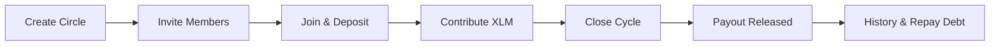

# Rotera

> **On-chain rotating savings circles powered by Stellar Soroban.**

Rotera replaces the traditional, informal rotating savings and credit associations (ROSCAs) used by billions of people worldwide — known as *chit funds* in India, *susu* in West Africa, *tanda* in Latin America, *stokvel* in South Africa, and *ajo* in Nigeria — with transparent, non-custodial smart contracts on Stellar.

---

## Problem

Informal savings circles are an essential financial tool for communities across the globe, allowing groups to pool funds and access lump-sum capital without traditional banking gatekeepers. However, traditional ROSCAs rely heavily on social trust and suffer from recurring failure modes:

- **Organizer Risk**: Human organizers collect cash, keep manual ledgers, and can mismanage or abscond with pooled funds.
- **Default & Ghosting**: Members who receive early payouts often default on subsequent contributions, leaving later members at a loss.
- **Coordination Friction**: Manually tracking payments, chasing late members across messaging apps, and calculating balances creates constant disputes.

---

## Solution

Rotera replaces the trusted human coordinator with an immutable Soroban smart contract on Stellar:

- **Contract-Enforced Accounting & Permissionless Payout Execution**: Contributions are deposited directly to the immutable Soroban smart contract, which strictly enforces accounting and payout rules on-chain. Once a cycle deadline passes, `close_cycle` is permissionless — callable by any participant or keeper wallet without relying on a trusted human coordinator.
- **Early-Exit Protection**: A 10% security deposit is locked on-chain when joining and cannot be withdrawn until all cycles are complete and all debts are settled.
- **On-Chain Debt Tracking**: Missed contributions are recorded as explicit on-chain debt, reducing payout shortfalls transparently and enabling members to repay their obligations.
- **Self-Sovereign Identity**: Members authenticate directly via their Freighter wallet; Rotera never takes custody of user keys or private funds.

---

## Features

- **Fixed-Contribution Circles**: Define fixed member sizes (3–12 members) and contribution amounts in XLM.
- **Deterministic & Verifiable Payout Sequencing**: Choose between join-order or deterministic on-chain randomized payout ordering.
- **Permissionless Keeper Execution**: Once a cycle deadline passes, `close_cycle` is callable by any wallet, allowing anyone to trigger turn advancement and payout distribution on-chain.
- **Stall & Debt Protection**: Zero-contribution cycles safely extend deadlines without burning the recipient's turn or compounding uncharged debt.
- **Transparent Audit History**: Full historical timeline of circle events, member payment reliability, on-chain transaction hashes, and contract-scoped Supabase audit logs.
- **Feedback & Observability**: Integrated user feedback widget, PostHog analytics, Sentry error monitoring, and Supabase audit event logging.

---

## User Flow



1. **Create**: The organizer creates a circle, setting the contribution amount, member count, payout ordering (join order or random), and cycle cadence.
2. **Invite & Join**: Members open the shareable invite link (`/join/:circleId`), connect their Freighter wallet, and join by locking the 10% entry deposit.
3. **Contribute**: Once all seats are filled, the circle activates. Members deposit their share before each cycle deadline.
4. **Close Cycle (Keeper)**: When the deadline passes, `close_cycle` is called. The smart contract tallies payments, calculates shortfalls, transfers the pot to the scheduled recipient, and advances the cycle index.
5. **Missed Payment & Debt Flow**: If a member misses a cycle, the contract records the shortfall as on-chain debt and marks their status as late. The member can clear their balance anytime via `repay_debt()`.
6. **Completion & Deposit Return**: After a full rotation finishes and all debts are cleared, members withdraw their original 10% security deposit via `withdraw_deposit()`.

---

## Architecture

```
+---------------------------------------------------------+
|              Rotera TanStack Start Frontend             |
|  (React 19 + TypeScript + TanStack Query + Tailwind)    |
+---------------------------------------------------------+
               |                          |
               v                          v
+-----------------------------+ +---------------------------------------+
|     Stellar / Soroban       | |         Observability & Data          |
|       Smart Contract        | | ------------------------------------- |
| --------------------------- | | • Sentry (Error Monitoring)           |
| • create_circle             | | • PostHog (Product Analytics)         |
| • join_circle               | | • Supabase (Feedback + Audit Events)  |
| • contribute                | | • Freighter Wallet API                |
| • close_cycle (Keeper)      | +---------------------------------------+
| • repay_debt                |
| • withdraw_deposit          |
| • get_status                |
+-----------------------------+
```

- **Frontend**: React 19, TypeScript, TanStack Start, TanStack Router, TanStack Query (sole authoritative cache for on-chain state), Tailwind CSS, and Motion.
- **Wallet**: Freighter API (`@stellar/freighter-api`) for cryptographic transaction signing.
- **Blockchain (Authoritative State)**: Stellar Testnet with Soroban smart contracts (`@stellar/stellar-sdk`). All financial state, balances, debts, member states, and payouts are enforced 100% on-chain.
- **Monitoring**: Sentry for production error tracking and exception handling.
- **Analytics**: PostHog for privacy-preserving user funnel analytics.
- **Supabase (Feedback + Audit Events)**: PostgreSQL database for user feedback widget submissions, contract-scoped circle event audit logs, and realtime audit invalidation triggers.

---

## Smart Contract

The core ROSCA logic is implemented in Rust (`contracts/rosca/src/lib.rs`) on Stellar Soroban:

| Function | Access | Description |
|---|---|---|
| `create_circle` | Organizer | Creates a savings circle with contribution amount, member limit, and cadence. |
| `create_circle_with_duration` | Organizer | Creates a circle with an explicit `cycle_duration_seconds: u64` parameter. |
| `join_circle` | Member | Locks the 10% security deposit and adds the member to the circle. |
| `contribute` | Member | Deposits the member's cycle contribution before the deadline. |
| `close_cycle` | Permissionless | Evaluates contributions, records missed payments as debt, pays recipient, and advances cycle. |
| `repay_debt` | Member | Settles outstanding debt from previously missed contributions. |
| `withdraw_deposit` | Member | Releases the 10% security deposit once the circle is completed and all debts are zero. |
| `get_circle` | Public | Returns complete circle configuration, members, and cycle histories. |
| `get_member_circles` | Public | Returns a list of circle IDs associated with a specific wallet address. |
| `get_status` | Public | Returns lifecycle status (`Filling`, `Active`, `Completed`). |

---

## Stellar Testnet Contracts

### Current Verified Testnet Contract — Green Belt Submission
- **Network**: Stellar Testnet
- **Contract ID**: `CDPLF2WY4NH57MYABBKLSPOJZVAMBFM5N2F5P7SPXS4KF2L6MRPMQ7TJ`
- **RPC Endpoint**: `https://soroban-testnet.stellar.org`
- **Network Passphrase**: `Test SDF Network ; September 2015`
- **Native XLM Token Contract**: `CDLZFC3SYJYDZT7K67VZ75HPJVIEUVNIXF47ZG2FB2RMQQVU2HHGCYSC`
- **Stellar Expert Explorer**: [View Verified Contract on Stellar Expert](https://stellar.expert/explorer/testnet/contract/CDPLF2WY4NH57MYABBKLSPOJZVAMBFM5N2F5P7SPXS4KF2L6MRPMQ7TJ)
- **Features Verified**: Full ROSCA lifecycle, contract-enforced payouts, debt creation, partial & full `repay_debt`, zero-debt resolution, and collateral security deposits.

### Legacy Contract (Historical Development)
- **Contract ID**: `CAY3GCWDFCXPU6JEIJAECX5UXWKXSKO5WTAV3QUFXFXRV4USNQ2FKLO4`
- **Note**: Circles created on the legacy contract remain archived on-chain for historical evidence and are not migrated. All active application workflows query the current verified contract.

---

## Accelerated Testnet Mode

To enable fast testing, demonstration, and evaluation without waiting days between cycles, Rotera supports accelerated test cycles on Stellar Testnet:

When `VITE_ENABLE_TEST_CYCLES=true`:
- `10` = **10 seconds**
- `30` = **30 seconds**
- `60` = **60 seconds**
- `300` = **5 minutes** (300 seconds)

> **Note**: Test cycle values represent literal seconds on the current dual-mode Testnet contract. The value `300` denotes a 5-minute testing cycle, **not** 300 days.

---

## Production Timing Architecture

For a future production/mainnet deployment, Rotera will use the `create_circle_with_duration` entrypoint which takes explicit `cycle_duration_seconds: u64`:

| Production Cadence | Value (Seconds) | Actual Duration |
|---|---|---|
| Weekly | `604,800` | Exactly 7 days |
| Bi-weekly | `1,209,600` | Exactly 14 days |
| Monthly | `2,592,000` | Exactly 30 days |

This architecture avoids dual-mode branching ambiguities and guarantees deterministic, accurate cycle deadlines across any time window. The current Testnet deployment uses accelerated test cadences (10s, 30s, 60s, 5min) via the dual-mode seconds branch.

---

## Supabase Audit Log & Schema Scoping

In addition to user feedback, Supabase stores supplemental audit event logs for circle lifecycles. Because different contract deployments can reuse circle IDs, all audit events are explicitly scoped by `(contract_id, circle_id)`:

```sql
create table if not exists circle_events (
  id bigint generated by default as identity primary key,
  contract_id text,
  circle_id text not null,
  event_type text not null,
  wallet_address text,
  amount_xlm numeric,
  tx_hash text,
  details jsonb default '{}'::jsonb,
  created_at timestamptz default now()
);

-- Index for performant contract_id + circle_id lookup:
create index if not exists idx_circle_events_contract_circle
on circle_events (contract_id, circle_id);
```

> **Authoritative State Note**: The Stellar Soroban smart contract is the sole authoritative source of truth for all circle state, member balances, and payouts. Supabase is used strictly for supplemental product history and user feedback.

---

## Security & Enforcement

- **Cryptographic Authentication**: Every state-modifying action requires strict `member.require_auth()` cryptographic signatures from the caller's Freighter wallet.
- **Double-Payment Protection**: The contract verifies whether a member has already contributed to the active cycle, rejecting duplicate payments.
- **Strict Membership Bounds**: Circles enforce fixed capacity (3–12 members); non-members cannot contribute or trigger member actions.
- **Deadline Verification**: Contributions cannot be submitted after the cycle deadline, ensuring predictable cycle transitions.
- **Deposit Locking**: The 10% holdback deposit is strictly locked in the contract until the entire circle finishes and the member's outstanding debt is zero.
- **Safe Turn Advancement**: Zero-contribution cycles retry without consuming the recipient's turn or compounding uncharged debt.

---

## Local Development

### Prerequisites
- Node.js (v18+) or Bun
- Rust toolchain (`rustup`) + `wasm32-unknown-unknown` target
- Freighter Browser Wallet Extension ([freighter.app](https://www.freighter.app/))

### Installation & Setup

```bash
# 1. Clone the repository
git clone https://github.com/subhadip890/Rotera.git
cd Rotera

# 2. Install dependencies
npm install

# 3. Configure environment variables
cp .env.example .env

# 4. Start local development server
npm run dev
```

### Verification Commands

```bash
# Run full verification suite (typecheck + lint + build + contract tests)
npm run verify

# Run individual checks
npm run typecheck       # TypeScript check (tsc --noEmit)
npm run lint            # ESLint check
npm run build           # Vite production build
npm run test:contract   # Cargo unit tests for Soroban contract
```

---

## Environment Variables

Configure the following environment variables in `.env` (refer to `.env.example`):

| Variable | Description |
|---|---|
| `VITE_SOROBAN_CONTRACT_ID` | Deployed Stellar Soroban ROSCA contract ID |
| `VITE_SOROBAN_RPC_URL` | Soroban RPC endpoint (e.g. `https://soroban-testnet.stellar.org`) |
| `VITE_SOROBAN_NETWORK_PASSPHRASE` | Network passphrase (e.g. `Test SDF Network ; September 2015`) |
| `VITE_ENABLE_TEST_CYCLES` | Set to `"true"` to enable accelerated testnet cycle options (10s, 30s, 60s, 5min) |
| `VITE_SUPABASE_URL` | Supabase project URL for user feedback and audit event logging |
| `VITE_SUPABASE_ANON_KEY` | Supabase public anonymous key |
| `VITE_POSTHOG_KEY` | PostHog API project key for analytics |
| `VITE_POSTHOG_HOST` | PostHog ingest host URL |
| `VITE_SENTRY_DSN` | Sentry DSN endpoint for error monitoring |

---

## Testing

The Soroban smart contract is tested via comprehensive Rust unit tests:

```bash
cd contracts/rosca
cargo test
```

**Test Results**: `47 passed; 0 failed; 0 ignored; 0 measured; 0 filtered out`

Test suite coverage includes:
- Circle creation, configuration validation, and member boundary limits
- Deterministic Fisher-Yates payout ordering shuffle and activation logic
- Cycle contributions, double-payment rejection, and deadline bounds
- Payout distribution, keeper cycle closures, and turn preservation on stalled cycles
- Repeated zero-contribution retry idempotency and debt tracking
- Partial and full debt settlement via `repay_debt`
- Security deposit locking, debt forfeiture, and withdrawal after rotation completion
- Production cadence calculation and explicit duration parameter handling

---

## Deployment

- **Smart Contract**: Deployed and active on Stellar Testnet (`CDPLF2WY4NH57MYABBKLSPOJZVAMBFM5N2F5P7SPXS4KF2L6MRPMQ7TJ`, legacy: `CAY3GCWDFCXPU6JEIJAECX5UXWKXSKO5WTAV3QUFXFXRV4USNQ2FKLO4`).
- **Production Deployment**: [https://rotera-seven.vercel.app/](https://rotera-seven.vercel.app/)
- **Hosting Provider**: Vercel (Nitro Node SSR Engine)
- **Deployment Branch**: `main`

---

## Stellar Level 4 — Green Belt Evidence

Rotera fulfills all mandatory requirements for the Stellar Level 4 Green Belt certification:

- **Public GitHub Repository**: [https://github.com/subhadip890/Rotera.git](https://github.com/subhadip890/Rotera.git) (`main` branch)
- **Live Production App**: [https://rotera-seven.vercel.app/](https://rotera-seven.vercel.app/) (Vercel SSR)
- **Verified Testnet Contract**: [`CDPLF2WY4NH57MYABBKLSPOJZVAMBFM5N2F5P7SPXS4KF2L6MRPMQ7TJ`](https://stellar.expert/explorer/testnet/contract/CDPLF2WY4NH57MYABBKLSPOJZVAMBFM5N2F5P7SPXS4KF2L6MRPMQ7TJ)
- **Smart Contract Test Suite**: 47 automated Cargo unit tests passing (`47 passed; 0 failed`)
- **Commit History**: 39+ clean, professional engineering commits
- **10+ Real User Onboarding Proof**: 12 unique on-chain transaction wallets, 10 matched testers with verified feedback and 50 confirmed Testnet transactions
- **User Feedback Collection**: 12 verified feedback submissions (average rating: 4.92 / 5.0) stored in Supabase
- **Mobile Responsive Design**: Fully responsive layout verified on 375px mobile viewports
- **Observability & Telemetry**: Integrated Sentry error monitoring, PostHog analytics, and contract-scoped Supabase audit logs
- **Detailed Evidence Document**: Complete submission dossier with transaction links, tester feedback tables, and screenshot proofs in [`docs/GREEN_BELT_SUBMISSION.md`](./docs/GREEN_BELT_SUBMISSION.md)

---

## Green Belt Submission Checklist

- [x] **Public GitHub Repository**: Clean codebase with complete documentation and commit history
- [x] **Working Stellar Testnet Contract**: Deployed and functional on Stellar Testnet (`CDPLF2...Q7TJ`)
- [x] **Production Deployment**: Live on Vercel at `https://rotera-seven.vercel.app/`
- [x] **Freighter Wallet Integration**: Seamless on-chain signing for creation, joining, payments, and settlements
- [x] **Smart Contract Test Suite**: 47 automated tests covering all core and edge cases
- [x] **Automated CI Workflow**: GitHub Actions verifying TypeScript, ESLint, production build, and contract tests
- [x] **Proof of 10+ Real User Wallet Interactions**: 12 unique transaction wallets with 50 confirmed transactions
- [x] **User Feedback Collection & Summary**: 12 feedback submissions (4.92/5.0) with documented feedback iterations
- [x] **Observability & Analytics**: Integrated Sentry error capture, PostHog telemetry, and Supabase audit logging
- [x] **Product UI Screenshots**: Desktop, mobile, and database screenshots preserved in `docs/screenshots/` and `docs/evidence/`
- [x] **Mobile Responsive Design**: Modern UI designed and verified across desktop and mobile viewports
- [ ] **Live Demo Video Link**: Final 3–5 minute walkthrough video *(User to record and add URL)*
